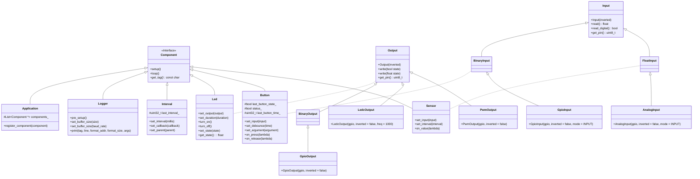

# WCAF <!-- omit in toc -->

> Wjtje's Cooperative Arduino Framework

## Table of Contents <!-- omit in toc -->

- [Features](#features)
- [Class Diagram](#class-diagram)
- [Example program](#example-program)
- [Logging](#logging)
- [Using built-in helpers](#using-built-in-helpers)
  - [Input](#input)
  - [Output](#output)
  - [Optional](#optional)
- [Using built-in components](#using-built-in-components)
  - [Button Component](#button-component)
  - [Led Component](#led-component)
  - [Interval Component](#interval-component)
  - [Sensor Component](#sensor-component)
- [Difference between Arduino and ESP8266](#difference-between-arduino-and-esp8266)
- [License](#license)

## Features

- Component based
- Logging support
- Low memory footprint
- Built-in interval support

## Class Diagram



## Example program

This is a basic program that will print `Hello World!` to the console every second.

```cpp
#include <Arduino.h>
#include <wcaf/components/application/application.h>
#include <wcaf/components/interval/interval.h>
#include <wcaf/components/logger/logger.h>

using namespace wcaf;

// Setup global variables
application::Application application_;
logger::Logger logger_;

// Set logger tag name
static const char* TAG = "Main";

void setup() {
  // Setup the logger
  logger_.set_buffer_size(128);
  logger_.set_baud_rate(9600);
  logger_.pre_setup();
  application_.register_component(&logger_);

  // Create an interval component
  interval::Interval* interval_ = new interval::Interval();
  interval_->set_interval(1000);
  interval_->set_callback([]() {
    // This code runs every second
    WCAF_LOG_INFO("Hello World!")
  });
  application_.register_component(interval_);

  application_.setup();
}

void loop() { application_.loop(); }
```

This code will result in the follow logs

```log
[I][Application:009]: Setting up 2 component(s)
[][Application:012]: Setting up Logger
[][Application:012]: Setting up Interval
[I][Main:025]: Hello World!
[I][Main:025]: Hello World!
[I][Main:025]: Hello World!
```

## Logging

One of the most important things to do is generating usefull logs for debugging your code. WCAF includes a simple logging framework with 4 different logging levels (DEFAULT, INFO, WARNING, ERROR).

**Example:**

```cpp
WCAF_LOG_DEFAULT("Not important");
WCAF_LOG_INFO("Hej, new data");
WCAF_LOG_WARNING("Hold up, something is not right");
WCAF_LOG_ERROR("Welp, it's broken");
```

```log
[ ][Main:001]: Not important
[I][Main:002]: Hej, new data
[W][Main:003]: Hold up, something is not right
[E][Main:004]: Welp, it's broken
```

## Using built-in helpers

WCAF includes a few helpers that are used by multiple components and can be used in custom components.

### Input

The Input helper will read analog or digital value and invert them if needed.

**Example:**

```cpp
#include <wcaf/helpers/input/analog.h>
#include <wcaf/helpers/input/gpio.h>

auto analog = new input::AnalogInput(A0);
float value = gpio_->read();

auto digital = new fpio::GpioInput(2);
bool value = gpio_->read_digital();
```

**Functions:**

```cpp
// Constructors
input::GpioInput(uint8_t gpio, bool inverted = false, uint8_t mode = INPUT);
input::AnalogInput(uint8_t gpio, bool inverted = false, uint8_t mode = INPUT);

// Functions
float read();
bool read_digital();
uint8_t get_pin();
```

### Output

The Ouput helper will send a state to a gpio pin.

**Example:**

```cpp
#include <wcaf/helpers/output/pwm.h>

auto output = new output::PwmOutput(6);
output->write(0.25f);
```

**Functions:**

```cpp
// Constructors
output::GpioOutput(uint8_t gpio, bool inverted = false);
output::LedcOutput(uint8_t gpio, bool inverted = false, double freq = 1000);
output::PwmOutput(uint8_t gpio, bool inverted = false);

// Functions
void write(bool state);
void write(float state);
uint8_t get_pin();
```

### Optional

This helper will help you while working with optional values.

**Example:**

```cpp
#include <wcaf/helpers/optional.h>

optional::Optional<int> state_;

if (state_.has_value()) {
  // Do some with the state
  WCAF_LOG_INFO("We have liftoff! %i", state_.value());
}
```

## Using built-in components

WCAF includes a few components to get you started. These components include the Button Component, Led Component, Interval Component, and Sensor Component.

### Button Component

The Button Component will read a digital value and debouce it before calling the on press and on release callback.

**Example:**

```cpp
#include <wcaf/components/button/button.h>

auto button_ = new button::Button();
button_->set_input(new input::GpioInput(7));
button_->on_release([]() {
  WCAF_LOG_INFO("I've been released!");
});
```

**Functions:**

```cpp
void set_input(interface::Input *input);
void set_debounce(uint32_t debouce);
// For callback function on Arduino see bottom of the page
void on_press(std::function<void()> &&lambda);
void on_release(std::function<void()> &&lambda);
```

### Led Component

The Led Component will send a 'smooth' pwm value to a gpio pin to change the state in the specified duration.

**Example:**

```cpp
auto led_ = new led::Led();
led_->set_output(new output::PwmOutput(2));
application_.register_component(led_);

// Somewhere else in your code
led_->turn_on();
```

**Functions:**

```cpp
void set_output(interface::Output *output);
void set_duration(uint32_t duration);
void set_interval(uint32_t interval);

void set_state(float state);
float get_state();

void turn_on();
void turn_off();
void toggle();

void start_blinking();
void stop_blinking();
void toggle_blinking();
```

### Interval Component

The Interval Component will execute the callback function every x milliseconds.

**Example:**

```cpp
interval::Interval* interval_ = new interval::Interval();
interval_->set_interval(1000);
interval_->set_callback([]() {
  // This code runs every second
  WCAF_LOG_INFO("Hello World!")
});
application_.register_component(interval_);
```

**Functions:**

```cpp
void set_interval(uint32_t interval);
// For callback function on Arduino see bottom of the page
void set_callback(std::function<void()> &&callback);
```

### Sensor Component

The Sensor Component will read an analog value every interval ms and run the `on_value` callback function.

**Example:**

```cpp
interval::Interval* sensor_ = new interval::Interval();
sensor_->set_input(new input::AnalogInput(A0));
sensor_->set_interval(1000);
sensor_->on_value([](float value) {
  // This code runs every second
  WCAF_LOG_INFO("Got value: %0.1f", value);
});
application_.register_component(sensor_);
```

**Functions:**

```cpp
void set_input(interface::Input *input);
void set_interval(uint32_t interval);
// For lambda function on Arduino see bottom of the page
void on_value(std::function<void(float)> &&lambda);
```

## Difference between Arduino and ESP8266

Due to the Arduino not having support for the default cpp libraries a few small things are different between the platforms. The main difference is that the Arduino doesn't have support for lambda function, but the included components have a "janky" way arround this. The following example shows how you can use the `set_argument` function to pass a pointer into a callback function.

```cpp
// Arduino
auto led_ = new led::Led();
led_->set_output(new output::PwmOutput(2, true));
application_.register_component(led_);

auto button_ = new button::Button();
button_->set_input(new input::GpioInput(5, true));
button_->set_argument(led_)
button_->set_on_release([](void *argument) {
  auto led_ = (led::Led *)argument;
  WCAF_LOG_INFO("The led state is: %0.1f", led_.get_state());
});
application_.register_component(button_);

// ESP8266
auto led_ = new led::Led();
led_->set_output(new output::PwmOutput(2, true));
application_.register_component(led_);

auto button_ = new button::Button();
button_->set_input(new input::GpioInput(5, true));
button_->set_on_release([led_]() {
  WCAF_LOG_INFO("The led state is: %0.1f", led_.get_state());
});
application_.register_component(button_);
```

## License

The MIT License (MIT) - Copyright (c) 2022 Wouter van der Wal

This code comes with ABSOLUTELY NO WARRANTY.
