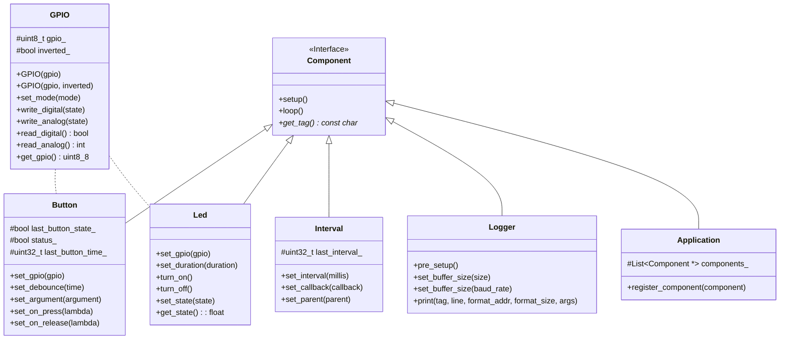

# WCAF

> Wjtje's Cooperative Arduino Framework

## Features

- Component based
- Logging support
- Low memory footprint
- Buildin interval support

## Class Diagram

## License

The MIT License (MIT) - Copyright (c) 2022 Wouter van der Wal
